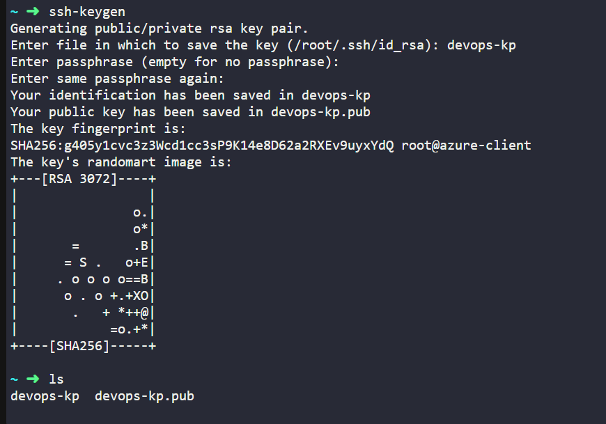
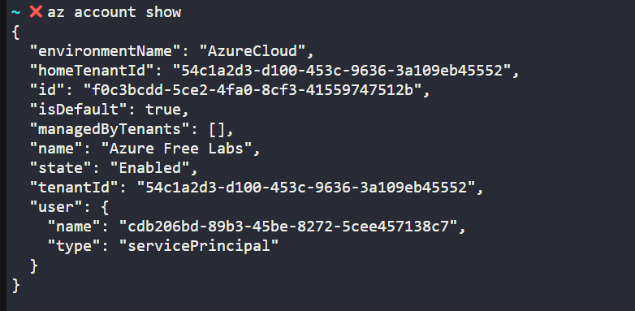
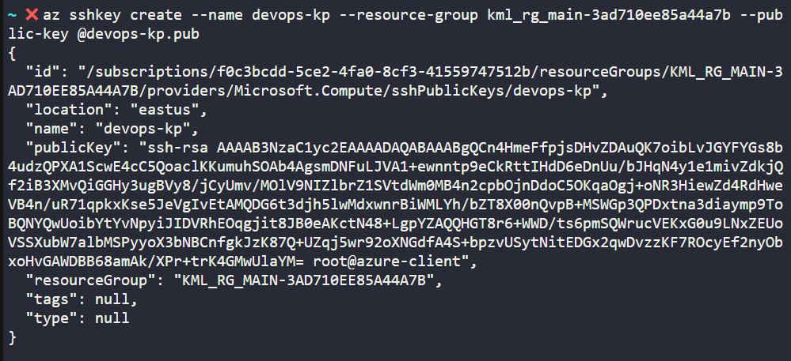
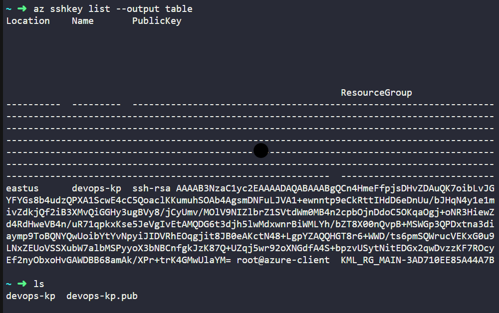
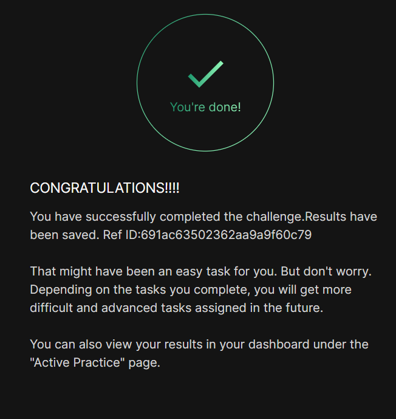

# Day 001
:shipit:

## Task

The Nautilus DevOps team is strategizing the migration of a portion of their infrastructure to the Azure cloud. Recognizing the scale of this undertaking, they have opted to approach the migration in incremental steps rather than as a single massive transition. To achieve this, they have segmented large tasks into smaller, more manageable units. This granular approach enables the team to execute the migration in gradual phases, ensuring smoother implementation and minimizing disruption to ongoing operations. By breaking down the migration into smaller tasks, the Nautilus DevOps team can systematically progress through each stage, allowing for better control, risk mitigation, and optimization of resources throughout the migration process.

For this task, create an SSH key pair with the following requirements:

The name of the SSH key pair should be devops-kp.

The key pair type must be rsa.


Use below given Azure Credentials: (You can run the showcreds command on the azure-client host to retrieve these credentials)

## Commands Used

```
ssh-keygen -t rsa -f devops-kp -N ""
az sshkey create --name devops-kp --resource-group <RG> --public-key @devops-kp.pub
az sshkey list --output table

```
created ssh key
- 

Az account details
- 

az rg list 
- 

create ssh key in azure
- 

verify
- 

## What I Learned

- How to generate an RSA SSH key using `ssh-keygen`.
- How to create an SSH key resource in Azure using Azure CLI.
- How to verify the SSH key using `az sshkey list`.

## Notes

- The SSH key name must match the requirement (`devops-kp`).
- The key type must be RSA.
- The public key (`.pub`) is uploaded to Azure while the private key stays on the client machine.

