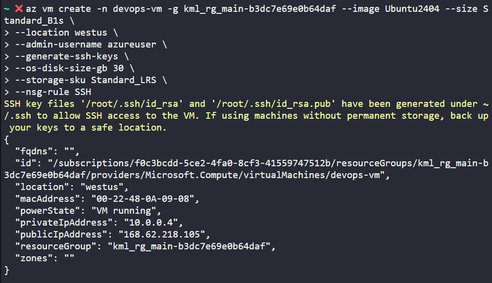
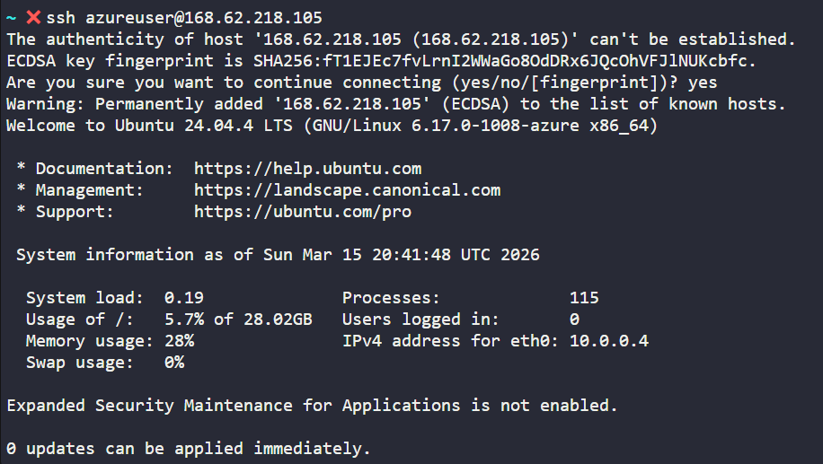
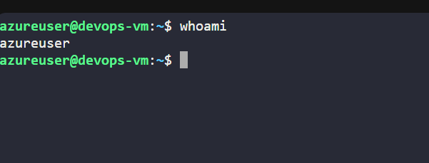
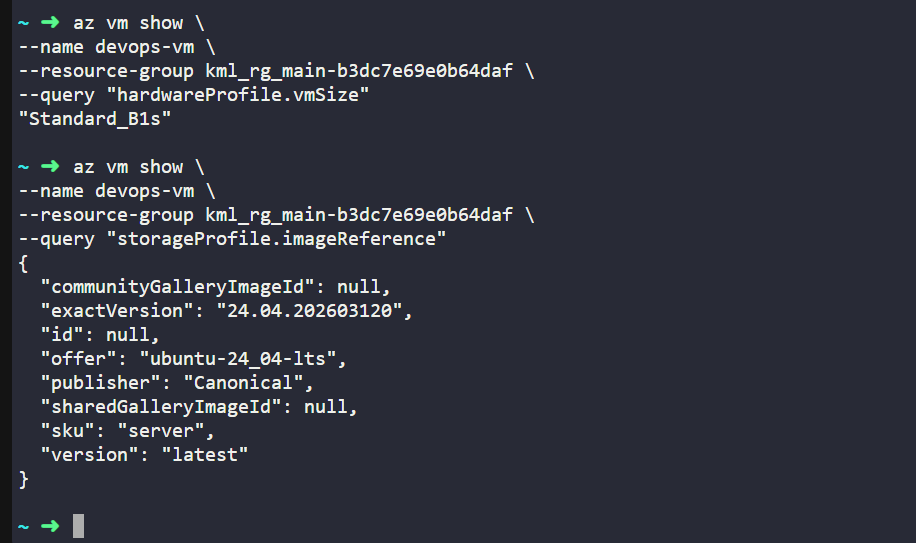

# Day 002
:shipit:

## Task

The Nautilus DevOps team is planning to migrate a portion of their infrastructure to the Azure cloud incrementally. As part of this migration, you are tasked with creating an Azure Virtual Machine (VM).

The requirements are:

1) Use the existing resource group.

2) The VM name must be devops-vm, it should be in westus region.

3) Use the Ubuntu 24.04 LTS image for the VM.

4) The VM size must be Standard_B1s.

5) Attach a default Network Security Group (NSG) that allows inbound SSH (port 22).

6) Attach a 30 GB storage disk of type Standard HDD.

7) The rest of the configurations should remain as default.

After completing these steps, make sure you can SSH into the virtual machine.


Use below given Azure Credentials: (You can run the showcreds command on the azure-client host to retrieve credentials)

## Commands Used

## Azure VM Creation Task – Full Command Flow

```
# 1. Get Azure credentials
showcreds

# 2. Login to Azure using service principal
az login --service-principal \
-u <appId> \
-p <password> \
--tenant <tenantId>

# 3. Check existing resource groups
az group list -o table

# 4. Create the VM
az vm create \
--resource-group <RESOURCE_GROUP_NAME> \
--name devops-vm \
--image Ubuntu2404 \
--size Standard_B1s \
--location westus \
--admin-username azureuser \
--generate-ssh-keys \
--os-disk-size-gb 30 \
--storage-sku Standard_LRS \
--nsg-rule SSH

# 5. Verify VM details
az vm show \
--name devops-vm \
--resource-group <RESOURCE_GROUP_NAME> \
-o table

# 6. Get VM public IP
az vm list-ip-addresses \
--name devops-vm \
--resource-group <RESOURCE_GROUP_NAME> \
-o table

# 7. SSH into the VM
ssh azureuser@<PUBLIC_IP_ADDRESS>

# 8. Confirm VM access
uname -a
```

Create the vm as per the requirements
- 

Login into the VM using the public IP :  "publicIpAddress": "168.62.218.105",
- 

Login worked
- 

Verify the other details
- 

## What I Learned
- `az vm create` is used to create Azure Virtual Machines from CLI.
- `--nsg-rule SSH` automatically creates an NSG allowing port 22.
- `--generate-ssh-keys` creates SSH keys for login.
- VM public IP can be retrieved using `az vm list-ip-addresses`.

## Notes
- VM Name: devops-vm
- Region: westus
- Image: Ubuntu 24.04 LTS
- Size: Standard_B1s
- Disk: 30GB Standard HDD
- SSH access enabled via NSG rule


