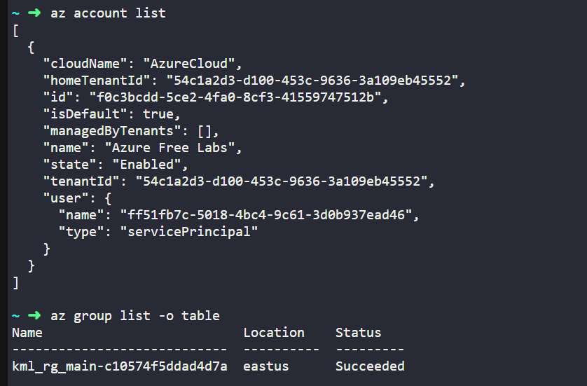
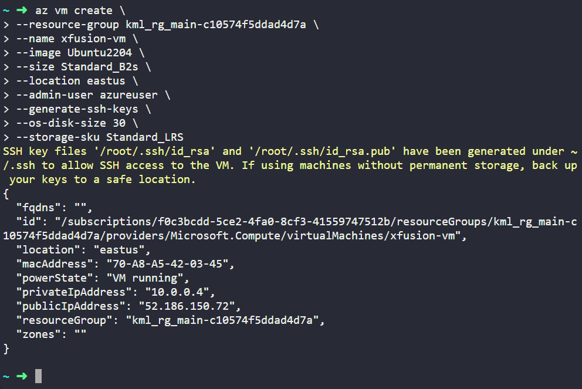
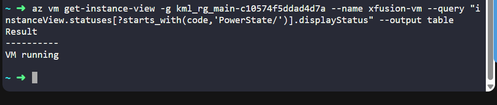
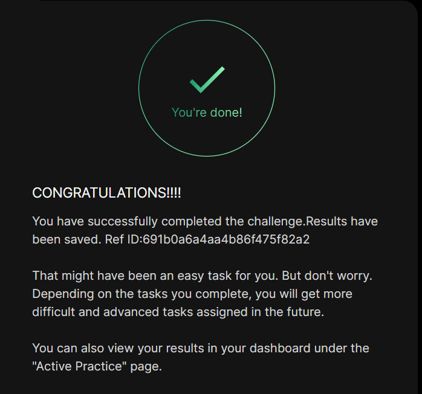

# Day 003
:shipit:

## Task

The Nautilus DevOps team is in the process of migrating some of their workloads to Azure. One of the tasks involves creating a new Virtual Machine (VM) using the Azure CLI. The team does not have access to the Azure portal but can manage Azure resources via the azure-client host (the landing host for this lab).

1) Create a new Azure Virtual Machine named xfusion-vm using the Azure CLI.

2) Use the Ubuntu2204 image and set the VM size to Standard_B2s.

3) Make sure the admin username is set to azureuser and SSH keys are generated for secure access.

4) Use Standard_LRS storage account, disk size must be 30GB and ensure the VM xfusion-vm is in the running state after creation.

## Commands Used


```
az vm create --resource-group <rg-name> --name xfusion-vm --image Ubuntu2204 --size Standard_B1s --os-disk-size-gb 30 --storage-sku Standard_LRS --admin-username azureuser --generate-ssh-keys

az vm get-instance-view --name xfusion-vm --resource-group <rg-name>

```

Check the account details
- 

Create VM 
- 

verify the Vm state
- 

## What I Learned

- Azure Virtual Machines can be created and managed using the **Azure CLI**.
- The `az vm create` command allows specifying VM configuration such as **VM name, resource group, OS image, disk size, and storage type**.
- The **OS disk size** can be customized using the `--os-disk-size-gb` option.
- Azure storage types like **Standard_LRS** provide locally redundant storage for VM disks.
- After creation, Azure automatically starts the VM unless specified otherwise.
- VM status can be verified using Azure CLI commands.

---

## Notes

- A VM named **xfusion-vm** was created.
- The **OS disk size was set to 30 GB**.
- The **storage account type used was Standard_LRS**.
- The VM was verified to be in the **running state after creation**.


