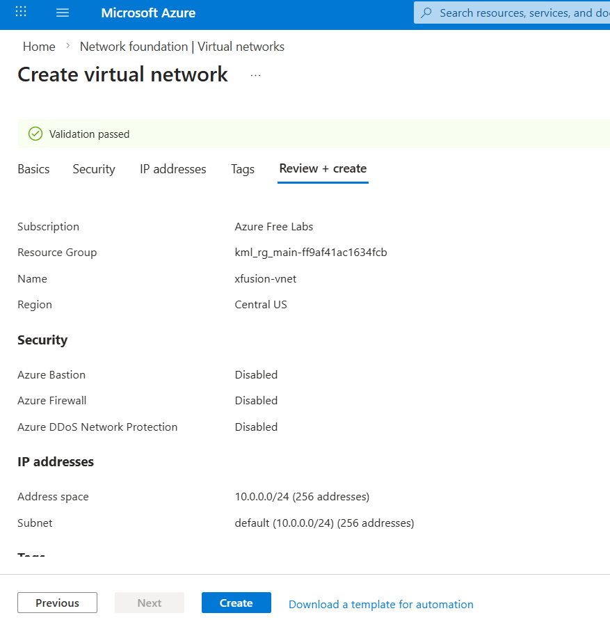
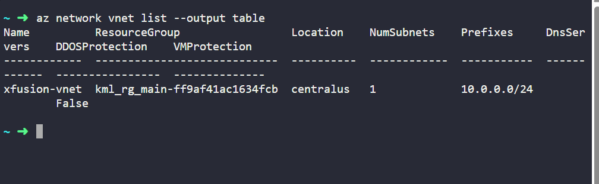
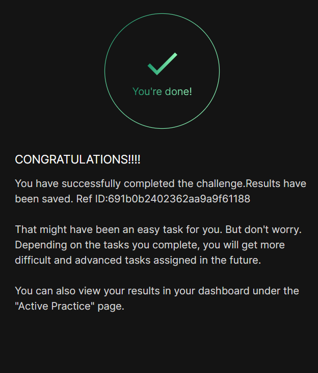

# Day 004
:shipit:

## Task

The Nautilus DevOps team is strategizing the migration of a portion of their infrastructure to the Azure cloud. Recognizing the scale of this undertaking, they have opted to approach the migration in incremental steps rather than as a single massive transition. To achieve this, they have segmented large tasks into smaller, more manageable units. This granular approach enables the team to execute the migration in gradual phases, ensuring smoother implementation and minimizing disruption to ongoing operations.

Create a Virtual Network (VNet) named xfusion-vnet in the centralus region with any IPv4 CIDR block.

Use below given Azure Credentials: (You can run the showcreds command on the azure-client host to retrieve these credentials)

## Commands Used

```
az network create  or
az network list --output table
```
This i haved used portal to create the vnet

- 

check the vnet
- 
## What I Learned

## Notes
