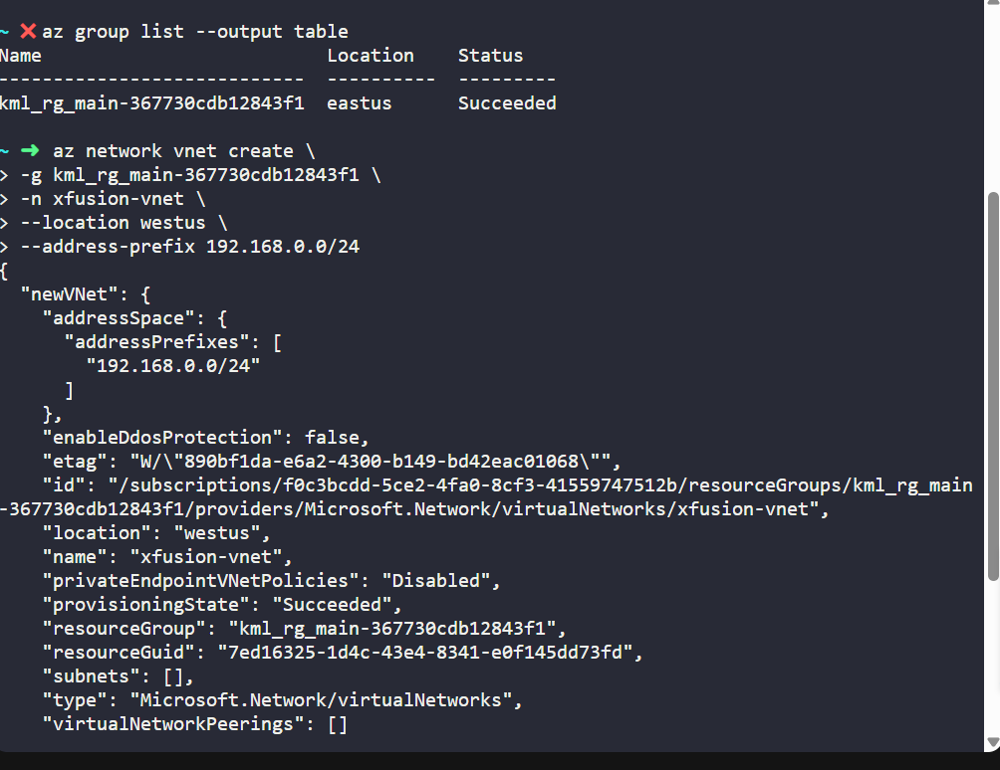
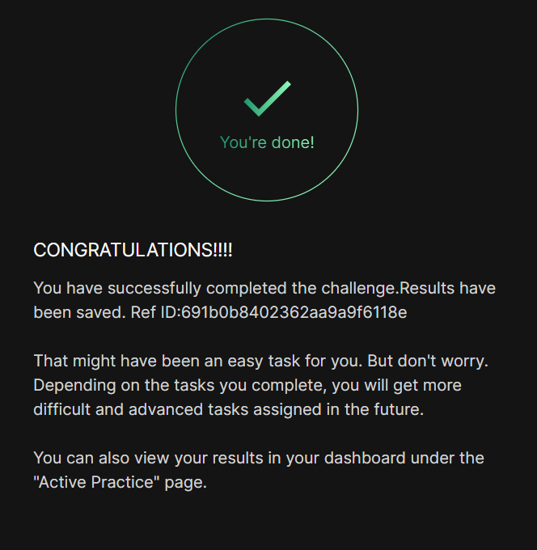

# Day 005
:shipit:

## Task

The Nautilus DevOps team is strategically planning the migration of a portion of their infrastructure to the Azure cloud. Acknowledging the magnitude of this endeavor, they have chosen to tackle the migration incrementally rather than as a single, massive transition. Their approach involves creating Virtual Networks (VNets) as the initial step, as they will be provisioning various services under different VNets.

Create a Virtual Network (VNet) named xfusion-vnet in the westus region with 192.168.0.0/24 IPv4 CIDR.

Use below given Azure Credentials: (You can run the showcreds command on the azure-client host to retrieve

## Commands Used

```
az group list --output table

az network vnet create \
  -g kml_rg_main-367730cdb12843f1 \
  -n xfusion-vnet \
  --location westus \
  --address-prefix 192.168.0.0/24

```
check the rg name and create the vnet
- 

## What I Learned

## Notes


