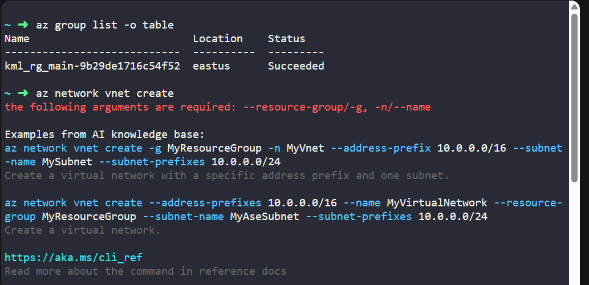
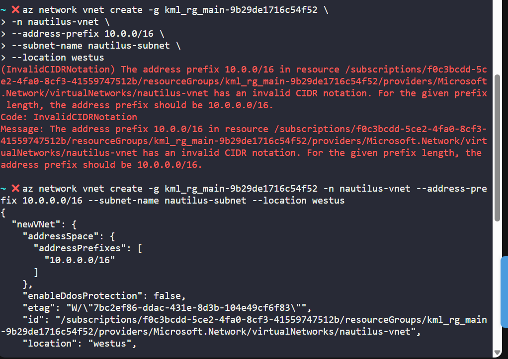
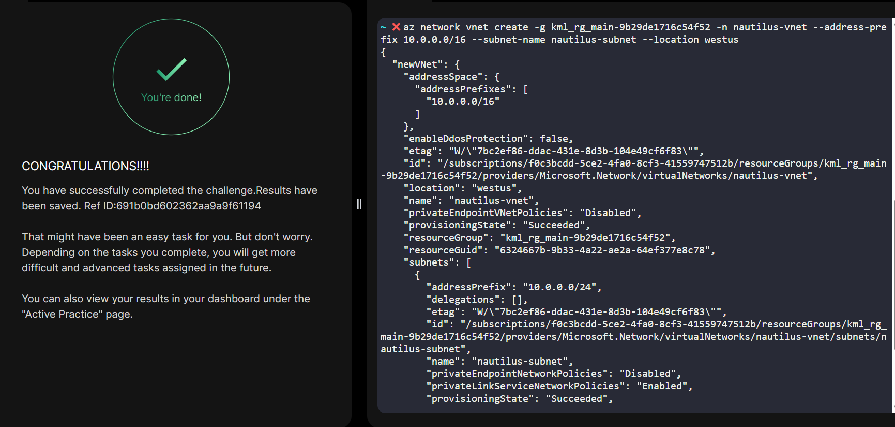

# Day 006
:shipit:

## Task

The Nautilus DevOps team is strategizing the migration of a portion of their infrastructure to the Azure cloud. Recognizing the scale of this undertaking, they have opted to approach the migration in incremental steps rather than as a single massive transition.

For this task, create a Virtual Network (VNet) named nautilus-vnet and one subnet named nautilus-subnet within the VNet in the westus region. Make sure the IPv4 address range is 10.0.0.0/16.

Use below given Azure Credentials: (You can run the showcreds command on the azure-client host to retrieve these credentials)

## Commands Used

check the resource group and get the az network vnet create command
- 

Enter the requirements as listed and leave the other options as default (you do not have to enter it, it will get set itself)

type error in first command of ip address fixed and it runs.
- 
## What I Learned

## Notes

