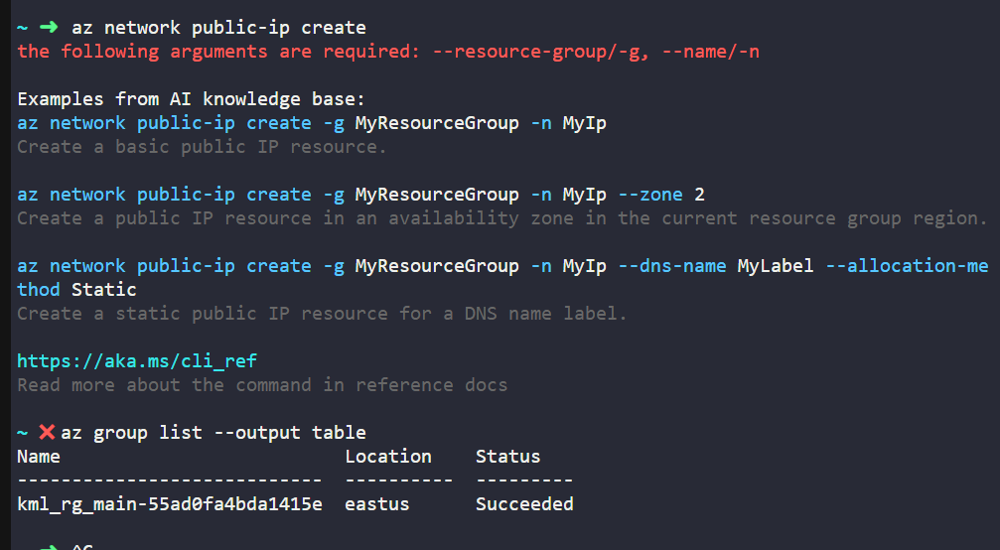
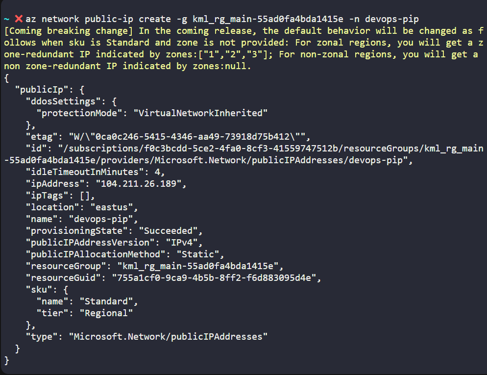
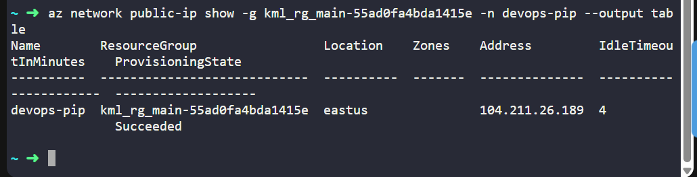
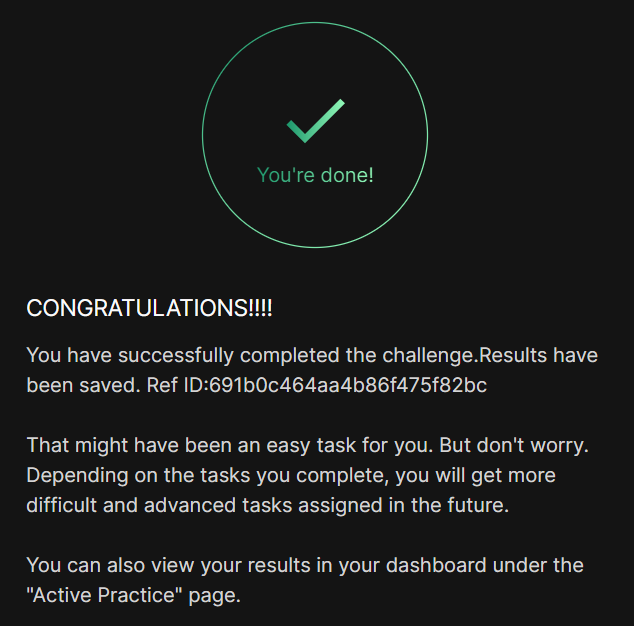

# Day 007
:shipit:

## Task

The Nautilus DevOps team is strategizing the migration of a portion of their infrastructure to the Azure cloud. Recognizing the scale of this undertaking, they have opted to approach the migration in incremental steps rather than as a single massive transition. To achieve this, they have segmented large tasks into smaller, more manageable units. This granular approach enables the team to execute the migration in gradual phases, ensuring smoother implementation and minimizing disruption to ongoing operations. By breaking down the migration into smaller tasks, the Nautilus DevOps team can systematically progress through each stage, allowing for better control, risk mitigation, and optimization of resources throughout the migration process.

For this task, allocate a Public IP address, name it as devops-pip.

Use below given Azure Credentials: (You can run the showcreds command on the azure-client host to retrieve credentials)

## Commands Used


```
az network public-ip create
az group list --output table
az network public-ip create -g kml_rg_main-55ad0fa4bda1415e -n devops-pip
az network public-ip show -g kml_rg_main-55ad0fa4bda1415e -n devops-pip --output table

```

check -g and get the basic command
- 

create public ip 
- 

verify the same
- 


## What I Learned

- The `az network public-ip create` command requires both `--resource-group` and `--name`.
- Azure resource groups can be listed using `az group list --output table`.
- A Public IP can be created in Azure using `az network public-ip create`.
- When no SKU is specified, Azure may create the Public IP with the default SKU.
- The created Public IP can be verified using `az network public-ip show`.
- The provisioning state `Succeeded` confirms that the Public IP was created successfully.

## Notes


