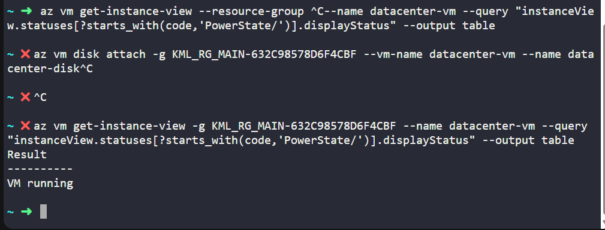
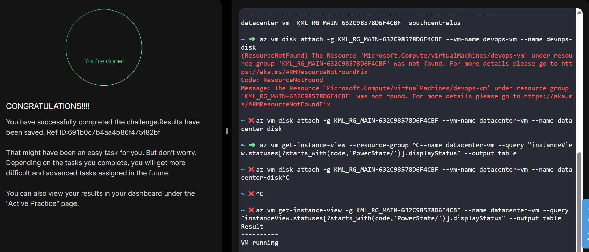

# Day 008
:shipit:

## Task
The Nautilus datacenter team is migrating services to Azure. They are breaking down tasks to ensure better control and optimization. You are tasked with attaching an existing data disk to a virtual machine (VM).

An existing VM named datacenter-vm and a managed disk named datacenter-disk already exist in the southcentralus region.

Attach the disk datacenter-disk to the VM datacenter-vm as a data disk.
Ensure the disk is attached to the VM datacenter-vm.
Make sure that the virtual machine initialization has been completed before submitting this task.

## Commands Used

az vm get-instance-view -g KML_RG_MAIN-632C98578D6F4CBF --name datacenter-vm --query "instanceView.statuses[?starts_with(code,'PowerState/')].displayStatus" --output table

```
az group list --output table
az vm disk attach --resource-group <resource-group-name> --vm-name devops-vm --name devops-disk
az vm show --resource-group <resource-group-name> --name devops-vm --query "storageProfile.dataDisks[].name" --output table
az vm get-instance-view --resource-group <resource-group-name> --name devops-vm --query "instanceView.statuses[?starts_with(code,'PowerState/')].displayStatus" --output table

```


## What I Learned

- Azure managed disks can be attached to an existing virtual machine as data disks.
- The `az vm disk attach` command is used to attach an existing managed disk to a VM.
- A data disk is different from the OS disk and is used for additional storage.
- The attached disk can be verified using `az vm show` and checking the `storageProfile.dataDisks` section.
- It is important to confirm that the VM is fully initialized and in a running state before submitting the task.

## Notes

- Attached the existing managed disk **devops-disk** to the virtual machine **devops-vm**.
- Verified that the disk appeared under the VM’s attached data disks.
- Confirmed the VM was properly initialized before task submission.


