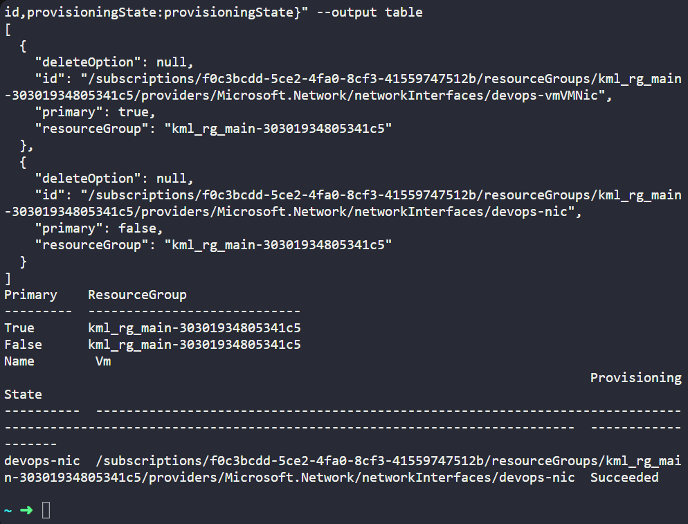
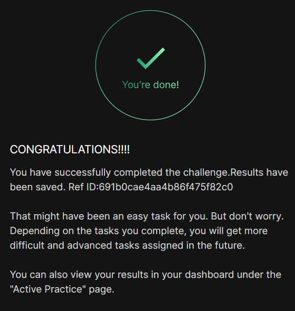

# Day 009
:shipit:

## Task

The devops DevOps team is migrating services to Azure. They are breaking down tasks to ensure better control and optimization. You are tasked with attaching an existing network interface (NIC) to a virtual machine (VM).

An existing VM named devops-vm and a network interface named devops-nic already exist in the eastus region.

Attach the network interface devops-nic to the VM devops-vm.
Ensure the NIC's status is attached before submitting the task.
Make sure that the virtual machine initialization has been completed before submitting this task.

## Commands Used

```
az group list --output table
az vm deallocate -g kml_rg_main-30301934805341c5 -n devops-vm
az vm nic add -g kml_rg_main-30301934805341c5 --vm-name devops-vm --nics devops-nic
az vm start -g kml_rg_main-30301934805341c5 -n devops-vm
az vm nic list -g kml_rg_main-30301934805341c5 --vm-name devops-vm --output table
az network nic show -g kml_rg_main-30301934805341c5 -n devops-nic --query "{name:name,vm:id,provisioningState:provisioningState}" --output table

```

- 
## What I Learned

## Notes


