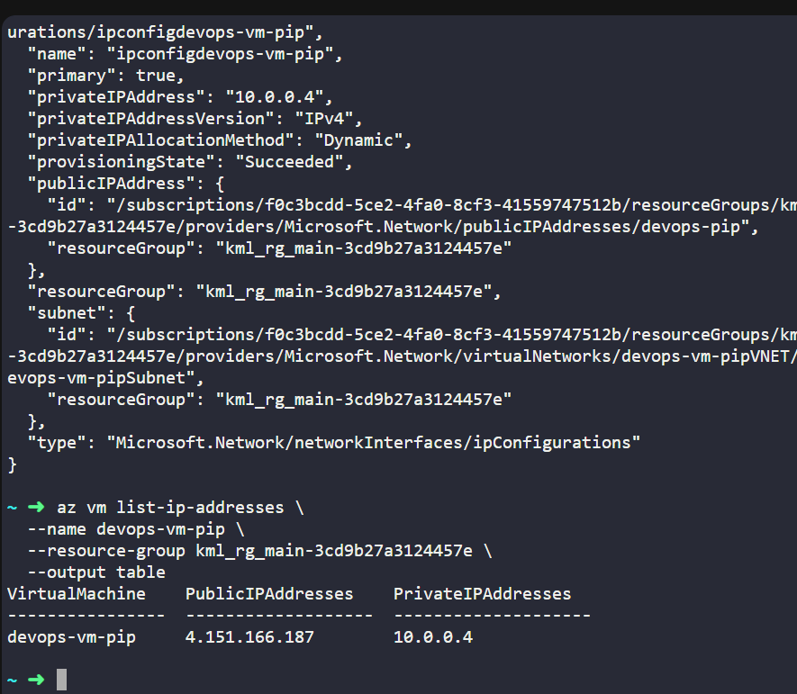
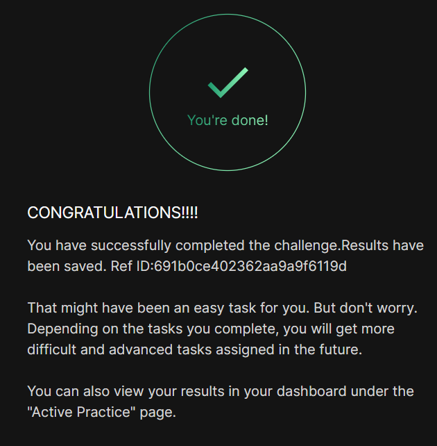

# Day 010
:shipit:

## Task

The Nautilus DevOps team has already set up a virtual machine and allocated a public IP address. The final task is to attach this public IP to the VM's network interface card (NIC).

An existing VM named devops-vm-pip and a public IP address named devops-pip already exist.

Attach the public IP devops-pip to the network interface of the VM devops-vm-pip.
Make sure the VM is properly assigned the public IP.

## Commands Used

- 
## What I Learned

# Attaching Public IP to a VM in Azure

## Overview
The task is to attach an existing public IP (`devops-pip`) to a VM (`devops-vm-pip`) in Azure, ensuring the VM can be accessed externally.

---

## Steps Summary

1. **Verify the Public IP**
   - Confirm that the public IP exists in the same resource group as the VM.  
   - Check its provisioning status to ensure it is ready to use.

2. **Identify the VM's Network Interface (NIC)**
   - Each VM has one or more NICs attached.  
   - Determine the NIC associated with the VM to attach the public IP.

3. **Check the NIC's IP Configuration**
   - Each NIC has an IP configuration with a specific name.  
   - Verify the IP configuration name to avoid errors during assignment.

4. **Attach the Public IP to the NIC**
   - Associate the public IP with the NIC's IP configuration.  
   - This enables external access to the VM through the specified public IP.

5. **Verify the Assignment**
   - Confirm that the VM is correctly assigned the public IP.  
   - The VM should now show the public IP in its details and be reachable externally.

---

## Outcome
- The VM `devops-vm-pip` is successfully associated with the public IP `devops-pip`.  
- External access to the VM is now possible via the assigned public IP.

## Notes

