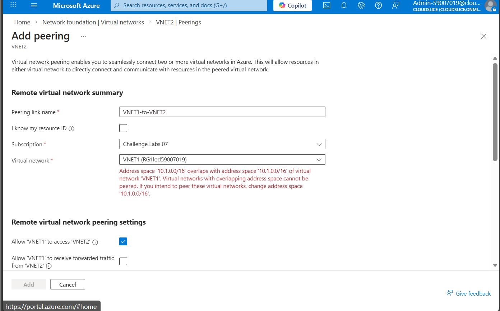
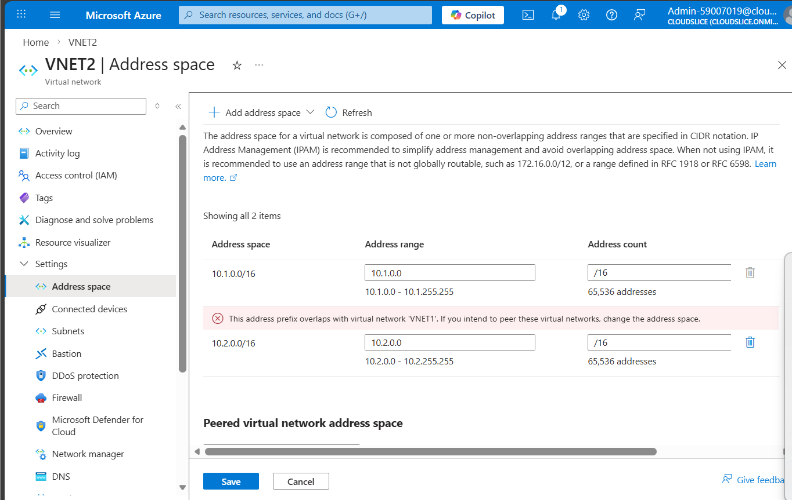
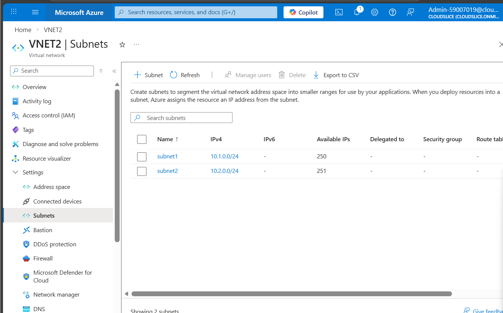
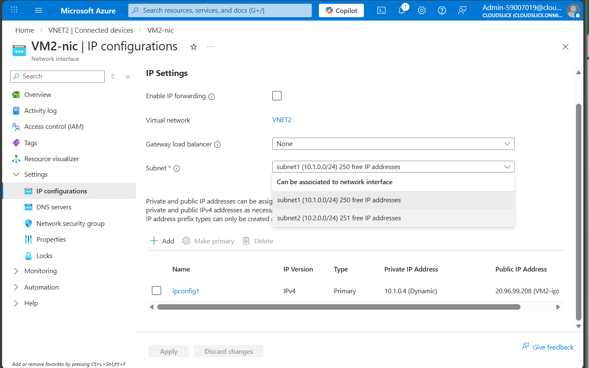
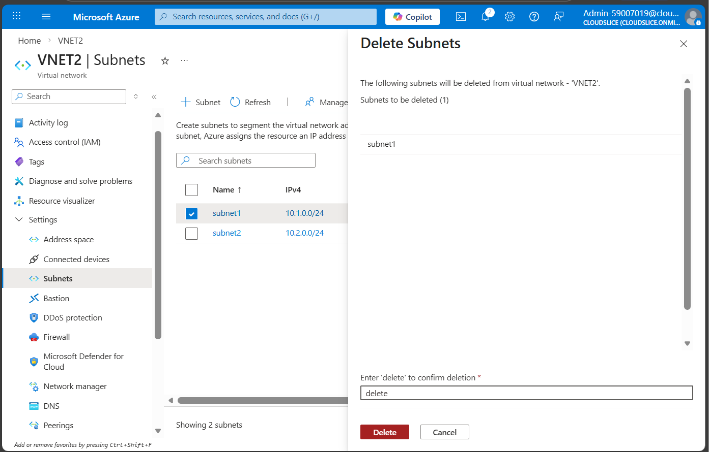
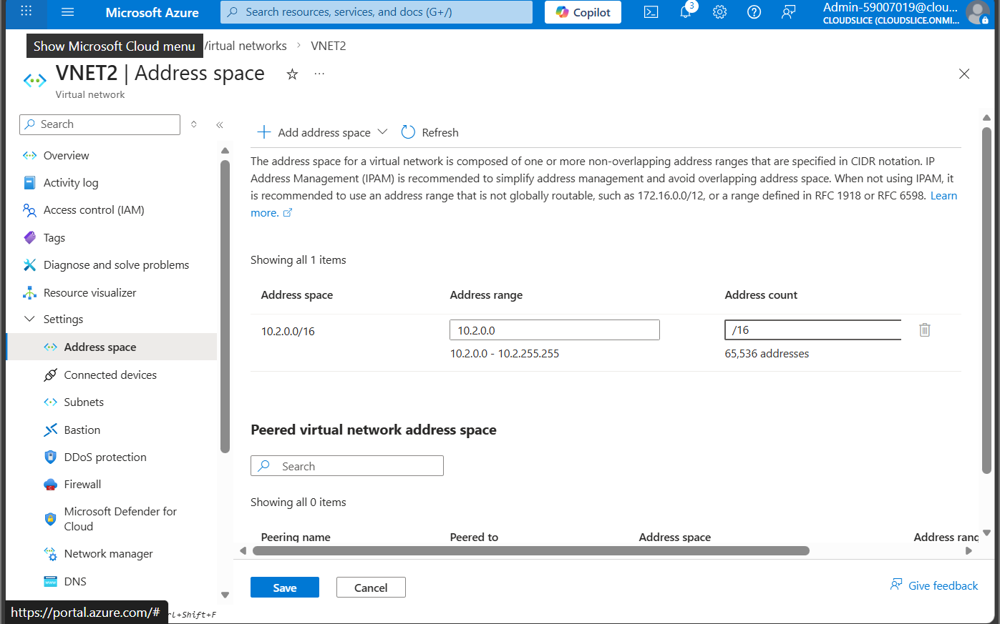
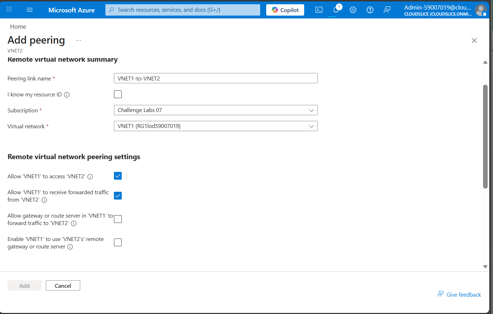
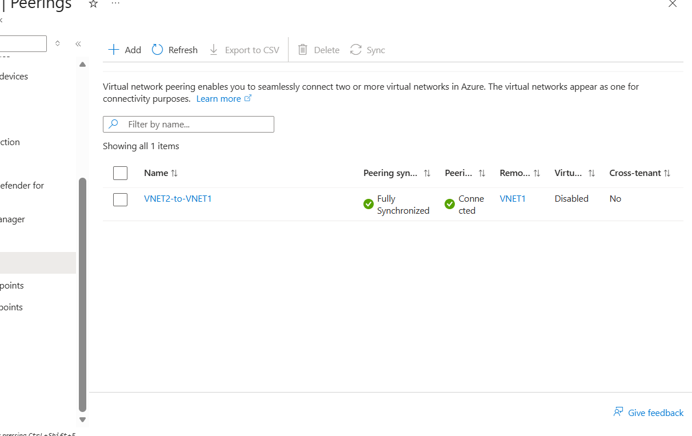
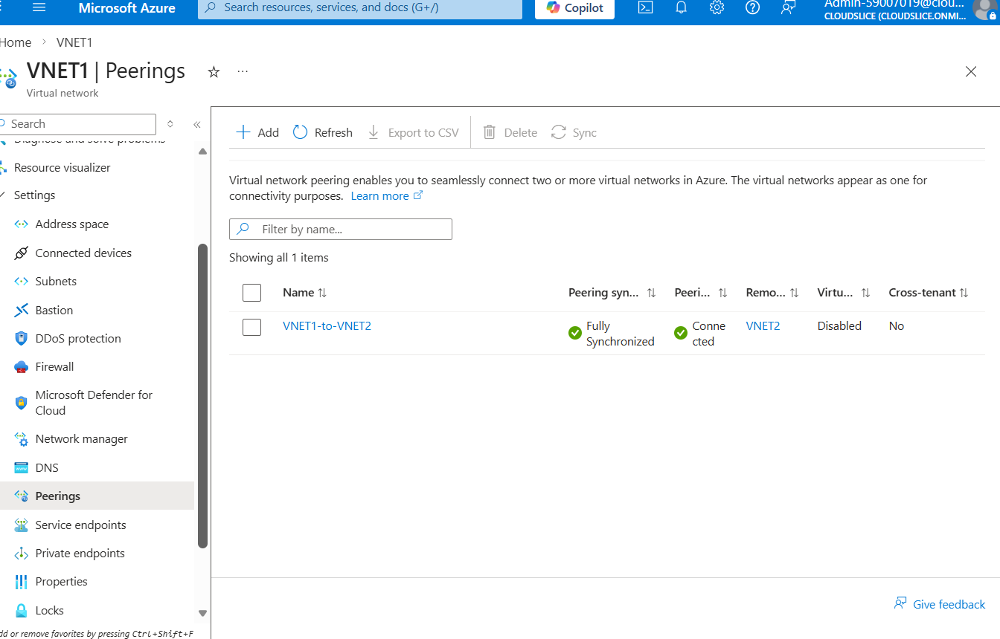
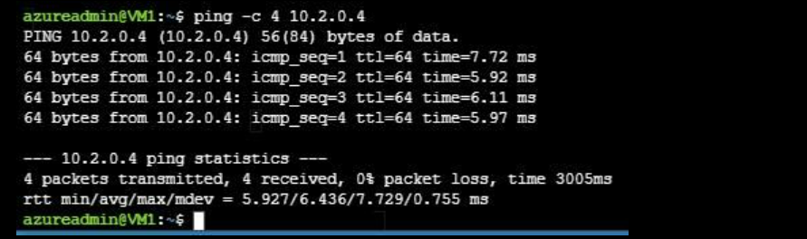

# Configure Global Virtual Network Peering

## About
In this challenge, you will configure a virtual network peering between the virtual networks for two applications hosted in different Azure regions. First, you will review existing Azure resources, and then you will verify that you are unable to add virtual network peerings between the existing virtual networks. Next, you will remove overlapping address spaces in the virtual network configuration. Finally, you will configure global virtual network peering between the two virtual networks. 

## Overview 
Configure Global Virtual Network Peering
Challenge Overview

Understand the scenario
You are an Azure® Security Engineer for Hexelo, an organization that needs to manage a virtual network.
In this Challenge Lab, you will configure a virtual network peering between the virtual networks for two applications hosted in different Azure regions. First, you will review existing Azure resources, and then you will verify that you are unable to add virtual network peerings between the existing virtual networks. Next, you will remove overlapping address spaces in the virtual network configuration. Finally, you will configure global virtual network peering between the two virtual networks.

## Started

### Steps
- Sign in to the Microsoft Azure portal.
- Select the Copy to clipboard icon to copy the text string to the clipboard.
Record the public IP address of VM1 in the following Public IP Address text box:
Public IP Address
You will use the public IP address in an upcoming task.
Review the address space and subnet configurations of the VNET1 virtual network.
Review the address space and subnet configurations of VNET2.
The address spaces of virtual networks that you intend to connect should not overlap. You will correct this in an upcoming task.

Check your work
Verify that you recorded the public IP address of VM1.

### 

addspace

subnet

select Ip2 for vmnic2

Delete sub1 for vnet2

delete addspace in vnet2

Adding Vnet peering

2to1

1to2

ssh and ping

### Summary :shipit:

Summary
Congratulations, you have completed the Configure Global Virtual Network Peering Challenge Lab.
You have accomplished the following:
Reviewed existing Azure resources.
Added a virtual network peering.
Remediated overlapping address spaces.
Configured global virtual network peering.
