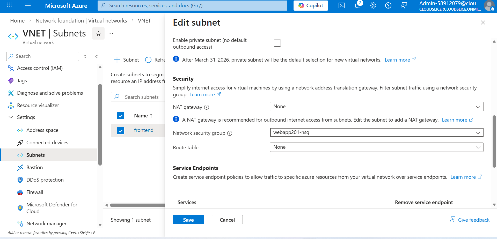

# Configure a Network Security Group in a Virtual Network

## About

In this challenge, you will configure a network security group to allow secure shell (SSH) connections to a virtual machine. First, you will create an application security group, and then you will create a network security group. Next, you will associate the network security group to a subnet in the virtual network, and then you will associate the application security group to the network interface on the virtual machine. Finally, you will add an inbound security rule, and then you will verify that you can connect to the virtual machine in the subnet by using SSH. 

## Challenge 

Understand the scenario

You are a Security Engineer for Hexelo, an organization that needs to manage network security in an Azure® virtual network.
In this Challenge Lab, you will configure a network security group to allow secure shell (SSH) connections to a virtual machine. First, you will create an application security group, and then you will create a network security group. Next, you will associate the network security group to a subnet in the virtual network, and then you will associate the application security group to the network interface on the virtual machine. Finally, you will add an inbound security rule, and then you will verify that you can connect to the virtual machine in the subnet by using SSH.

## Create Azure security groups

   - Sign in to the Microsoft Azure portal.
   - Select the Copy to clipboard icon to copy the text string to the clipboard.
   - Create an Application security group named webapp201-asg in the (US) East US region by using the RG1lod58912079 resource group.
   
   - Create a Network security group named webapp201-nsg in the (US) East US region by using the RG1lod58912079 resource group.
   
   - It may take approximately 1-2 minutes to deploy the network security group. Wait for the deployment to finish before continuing.
Check your work

- Verify that you have created an application security group named webapp201-asg.
- Verify that you have created a network security group named webapp201-nsg.

### Associate Azure security groups to Azure resources

  - Associate the webapp201-nsg network security group to the frontend subnet in the VNET virtual network.
  

  - Associate the webapp201-asg application security group to the RG1lod58912079 NIC on the VM1 virtual machine.

  
  - Record the Primary NIC public IP of VM1 in the following Public IP Address text box:
  - Public IP Address : 20.237.109.45 (VM1-ip)
  - You will use the public IP address in an upcoming task.

Check your work
- Verify that you have associated the webapp201-nsg network security group to the frontend subnet in the VNET virtual network.
- Verify that you have associated the webapp201-asg application security group to the NIC on VM1.

### Connect to a Linux virtual machine by using SSH

  - Open an Azure Cloud Shell Bash session without mounting a storage account.
  - Attempt to connect to the Linux virtual machine at azureadmin@20.237.109.45 (VM1-ip) by using Cloud Shell and a secure shell (SSH)] connection.
   
   
    Wait until the command produces results. This may take a few minutes.
  - Determine if the SSH connection to the Linux virtual machine timed out, and then record your findings in the following drop-down list:
    
    Did the SSH connection to the Linux vrtual machine time out?

  - The SSH connection is expected to time out because the network security group does not yet have an incoming rule to allow SSH.
    Close the Cloud Shell window.
Check your work

- Verify that the SSH connection to the Linux virtual machine has timed out.

### Create an inbound security rule to allow SSH

Create an inbound security rule named AllowSSH in the webapp201-nsg network security group, and then configure the rule to allow incoming TCP traffic on port 22 to the webapp201-asg application security group.
Wait for the rule creation to finish before continuing.
Open Cloud Shell, connect to the virtual machine at azureadmin@20.237.109.45 (VM1-ip) by using an ssh connection, and then when prompted, enter AzurePassw0rd! as the password.
Because this is a Linux virtual machine, you will not see the password displayed in Cloud Shell.

Check your work

Verify that you have created an inbound security rule named AllowSSH that allows SSH traffic to the application security group.
### Test the web app on a single virtual machine

### Summary

