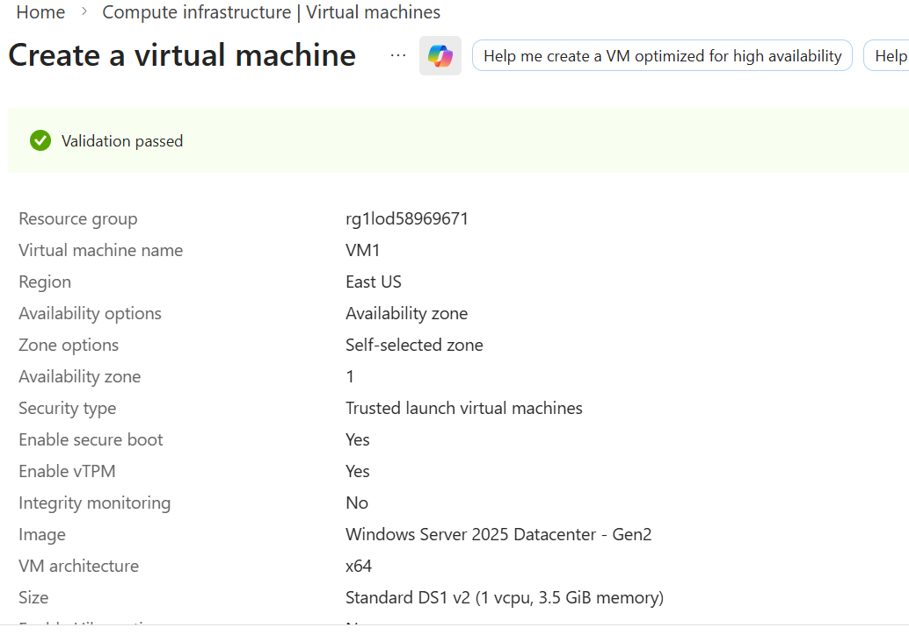
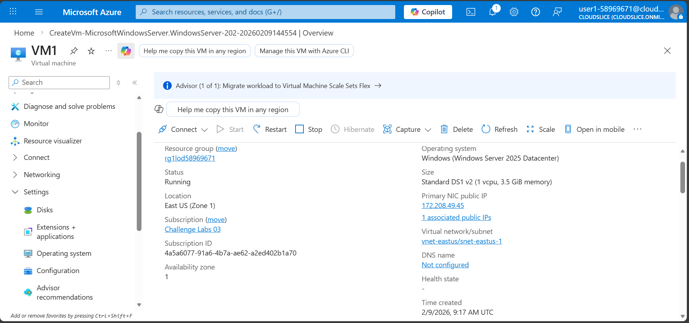
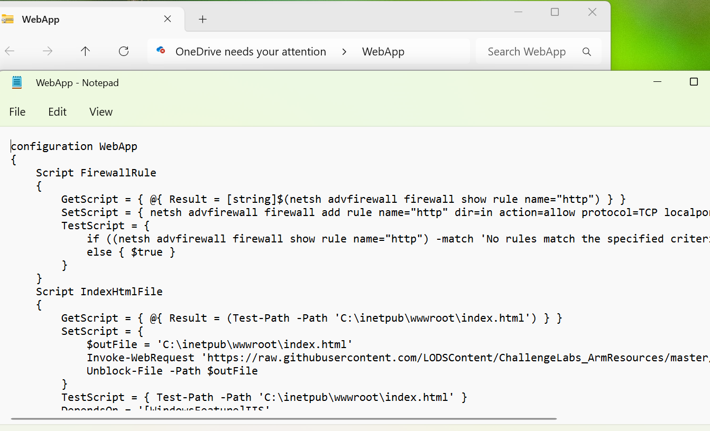
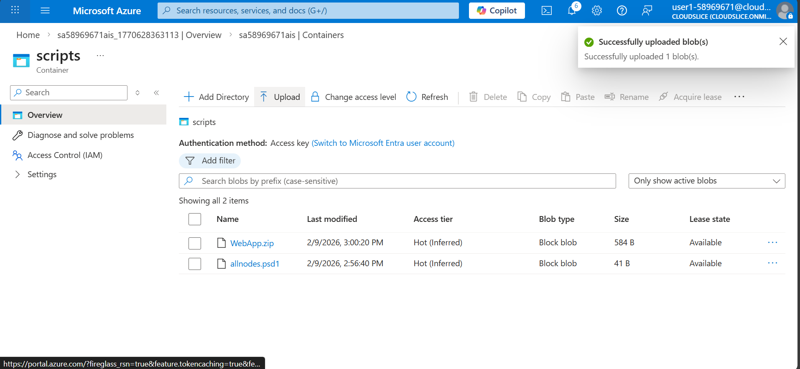
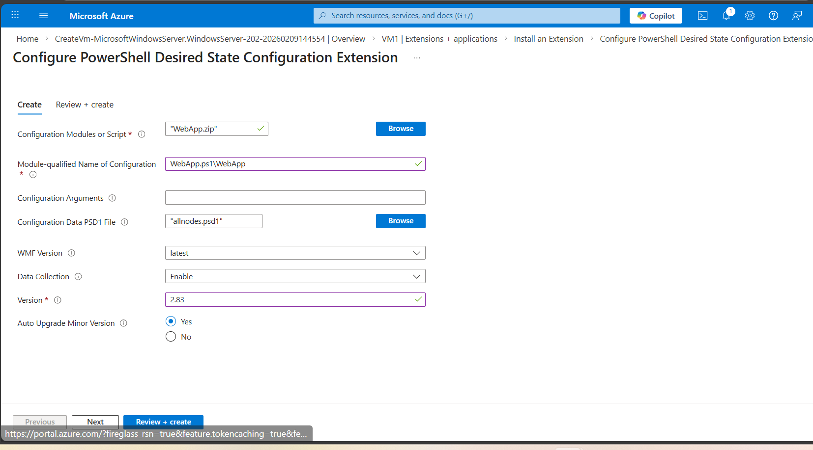

# Configure a Virtual Machine by Using a PowerShell DSC Extension

## About
In this challenge, you will automate the configuration of a web app on a new server. First, you will create a storage account, and then you will create a Windows virtual machine. Next, you will create the configuration files. Finally, you will apply a PowerShell Desired State Configuration (DSC) extension, and then you will verify that the web app loads. Note: Once you begin the challenge, you will not be able to pause, save, or exit and then return to your challenge. Please ensure that you have set aside enough time to complete the challenge before you start.

## Overview 
Understand the scenario

You are an Administrator for Hexelo, an organization that needs to manage Windows® virtual machines in Azure®.
In this Challenge Lab, you will automate the configuration of a web app on a new server. First, you will create a storage account, and then you will create a Windows virtual machine. Next, you will create the configuration files. Finally, you will apply a PowerShell® Desired State Configuration (DSC) extension, and then you will verify that the web app loads.
Navigating the Challenge Lab
## Started

### Create a storage account

- Sign in to the Microsoft Azure portal.
- Select the Copy to clipboard icon to copy the text string to the clipboard.
- Create a storage account named sa58969671ais in the rg1lod58969671 resource group by using the default settings.
- Add a container named scripts to the sa58969671ais storage account.

Check your work
- Verify that you have created a storage account.
- Verify that you have created a container named scripts in the storage account.

### Create a Windows virtual machine

- Create a virtual machine by using the values in the following table. For any property that is not specified, use the default value.

Virtual Machine Configuration

| Property | Value |
| :--- | :--- |
| **Resource group** | rg1lod58969671 |
| **Virtual machine name** | VM1 |
| **Image** | Windows Server 2019 Datacenter - x64 Gen 2 |
| **Size** | DS1_v2 |
| **Username** | azureuser |
| **Password** | f3pMVNuye=qA |
| **Select inbound ports** | HTTP (80), RDP (3389) |
| **Boot diagnostics** | Disable |

- While it is possible to add the PowerShell DSC extension at the time you create the virtual machine, in this Challenge Lab, you will add the extension in the next step.
- Do not continue until the deployment is complete. This will take approximately 2-4 minutes.
- Record the public IP address of VM1 in the following Public IP Address text box:

Public IP Address : 172.208.49.45

- You will use the public IP address in an upcoming task.

Check your work

- Verify that you have created a virtual machine named VM1.
- Verify that you have recorded the public IP address of VM1.

### Create the configuration files

- Copy the content from the WebApp.ps1 Windows PowerShell DSC file, paste the content into a text editor-for example, Notepad-on your local computer, and then save the file on your desktop as WebApp.ps1.
[Link](https://raw.githubusercontent.com/LODSContent/ChallengeLabs_ArmResources/master/Labs/AIS/WebApp.ps1?fireglass_rsn=true#fireglass_params&tabid=a8a3a4004ab45bd0&application_server_address=hclindiawi-3-asia-south1.prod.fire.glass&popup=true&is_right_side_popup=false&start_with_session_counter=1)

- Create a ZIP file named WebApp.zip that contains only the file WebApp.ps1.

- Make sure you do not add any extra files or folders.
- Copy the configuration for the deployment from the allnodes.psd1 PowerShell module manifest file, paste the content into a text editor on your local computer, and then save the file on your desktop as allnodes.psd1.
[Link](https://raw.githubusercontent.com/LODSContent/ChallengeLabs_ArmResources/master/Labs/AIS/allnodes.psd1?fireglass_rsn=true#fireglass_params&tabid=a5aa649515b669c0&application_server_address=hclindiawi-3-asia-south1.prod.fire.glass&popup=true&is_right_side_popup=false&start_with_session_counter=1)

Upload the WebApp.zip and allnodes.psd1 files to the scripts container in the sa58969671ais storage account.

Check your work
Verify that you have uploaded the WebApp.zip and allnodes.psd1 files to the scripts container in the storage account.

### dd a PowerShell DSC extension

Add a PowerShell Desired State Configuration extension for VM1, and then configure the extension by using the values in the following table. For any property that is not specified, use the default value.

| Property | Value |
| :--- | :--- |
| **Configuration Modules or Script** | WebApp.zip |
| **Module-qualified Name of Configuration** | WebApp.ps1\WebApp |
| **Configuration Data PSD1 File** | allnodes.psd1 |

- Version	The latest version specified on the Azure DSC extension version history page
Wait until the DSC extension has been provisioned.
- [Link](https://learn.microsoft.com/en-us/azure/automation/automation-dsc-extension-history?fireglass_rsn=true#fireglass_params&tabid=a8b59e44289f42c1&application_server_address=hclindiawi-3-asia-south1.prod.fire.glass&popup=true&is_right_side_popup=false&start_with_session_counter=1)

- This will take approximately 3-5 minutes.
- In a new browser window, go to http://72.208.49.45, and then periodically refresh the browser window until the Test Web App Deployment page is displayed.

- It may take as long as 10 minutes for the virtual machine extension to be created and for the script to finish running.

Check your work
- Verify that you have added a PowerShell DSC extension to a virtual machine by using the Install-webApp.ps1 script.
- Verify that you have displayed the Test Web App Deployment page that was installed by the PowerShell DSC extension.

### Summary :shipit:

Congratulations!!
You have completed the Configure a Virtual Machine by Using a PowerShell DSC Extension Challenge Lab.
In this challenge, you accomplished the following:
- Created a storage account.
- Created a Windows virtual machine in Azure.
- Created a PowerShell DSC extension.
- Added a PowerShell DSC extension to a virtual machine.

