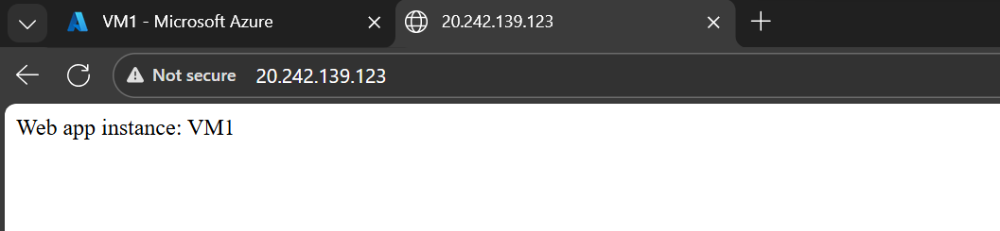

# Automate and Manage Custom, Scalable Azure VM–Based Infrastructure Solutions

## About

In this challenge, we will create a custom image, use the image to create a scale set with availability zones, configure autoscale, and deploy an update to the scale set using a custom script extension. 

## Challenge 
> Understand the scenario
Assume :
You are an Adminstrator for Hexelo, an organization that needs to Automate and Manage Custom, Scalable Azure VM-Based Infrastructure Solutions
In this Challenge, you will configure high availability by using availability zones and autoscale. First, you will convert a virtual machine that contains a web app into a scale set that uses availability zones for high availability. Next, you will configure autoscale. Finally, you will deploy an update to the scale set by using a custom script extension.

## Started

### Test the web app on a single virtual machine
   - Open Microsoft Edge, sign in to the Microsoft Azure portal at https://portal.azure.com as
   - Select the Type Text icon to enter the associated text into the virtual machine.
   - Record the public IP address of VM1 in the following Public IP Address text box:
   
   - Public IP Address : http://20.242.139.123/
   - Open a new browser tab, go to http://<PIP>, and then verify that the web app displays Web app instance: VM1.
   

### Create a custom virtual machine image
  - Connect to VM1 by using RDP, and then sign in as AzureAdmin using examplepassword as the password.
  -  In the RDP session, generalize the virtual machine by using sysprep.exe, configure the virtual machine to use an out-of-the-box experience, and then shutdown the virtual machine.
  -  Verify that VM1 is stopped and then create a managed image only (i.e., not shared to a gallery as a VM image version) named app1-image that is based on VM1.
  -  Wait for the deployment to complete before continuing. It may take 3-4 minutes.

### Create a virtual machine scale set that uses autoscale
  -  Create a virtual machine scale set by using the values in the following table. For any property that is not specified, use the default value.

        | Property | Value |
        | :--- | :--- |
        | **Resource group** | RG1lod58909331 |
        | **Virtual machine scale set name** | app-scaleset |
        | **Availability zone** | Zones 1,2 |
        | **Orchestration mode** | Uniform: optimized for large scale stateless workloads with identical instances |
        | **Image** | My images: app1-image |
        | **Size** | DS1_v2 |
        | **Username** | AzureAdmin |
        | **Password** | AzurePassw0rd! |
        | **License type** | Windows server |
        | **Public IP address** | Enabled |
        | **Use a load balancer** | Azure load balancer |
        | **Select a load balancer** | Create a load balancer |
        | **Load balancer name** | lb1 |
        | **Upgrade mode** | Automatic - Instances will start upgrading immediately in random order |


  > In this Challenge Lab, you must use DS1_v2 as the instance size or the deployment will fail.
  -  Add a scale-out metric rule to the Default policy that will increase the instance count by 1 when the average percentage CPU is greater than 75 percent.
  - Add a scale-in rule to the Default policy that will decrease the instance count by 1 when the average percentage CPU is less than 25 percent.

### Verify network connectivity
  - Create an inbound security rule named HTTP in the basicNsgrg1lod16251513-vnet-nic01 network security group that allows TCP traffic on port 80.
  - Record the public IP address of app-scaleset in the following Public IP Address - VMSS text box:
  - Public IP Address - VMSS
  - Open a new browser tab, go to http://<PIP-VMSS>, and then verify that the web app displays Web app instance: VM1.

### Deploy an update to a web app
Create a file named Update-WebApp.ps1, edit it to contain the following script, and then save the file.
```
# Update index.html file
  - Set-Content -Path "C:\inetpub\wwwroot\index.html" -Value "Web app instance updated $($env:computername)"
```
  - Create a new container named scripts in the sa58909331 storage account, and then upload the Update-WebApp.ps1 file.
  - Add a Custom Script Extension to app-scaleset by using Update-webApp.ps1 in the sa58909331 storage account.
  - Open a new browser tab, go to http://<PIP-VMSS>, and then verify that the web app displays Web app instance updated app-scaleset00000X - where X is any instance number-you may need to refresh the new browser tab several times.
    The updated web app displayed in the browser

### Summary
  - Congratulations, :shipit:
  
    You have completed the Automate and Manage Custom, Scalable Azure VM-Based Infrastructure Solutions.
  - You have accomplished the following:
    Tested the web app on a single virtual machine.
  - Created a custom virtual machine image.
  - Created a virtual machine scale set that uses autoscale.
  - Verified network connectivity.
  - Deployed an update to a web app.